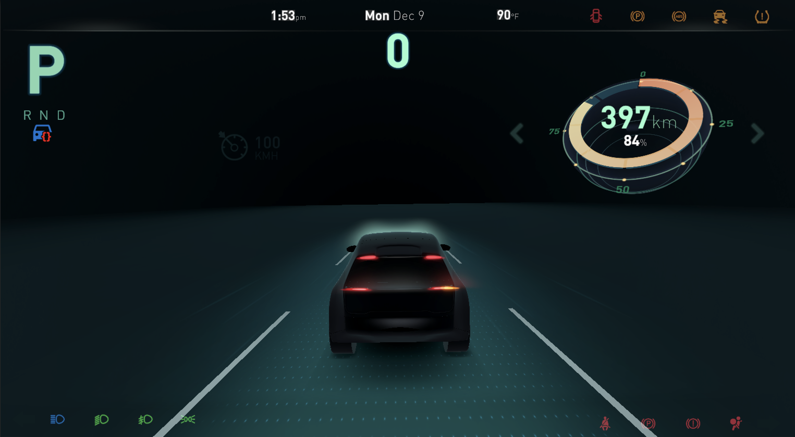
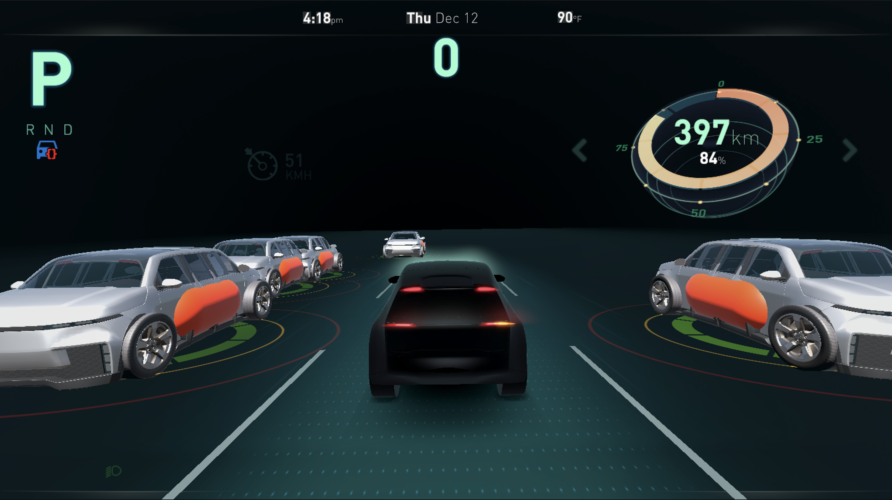
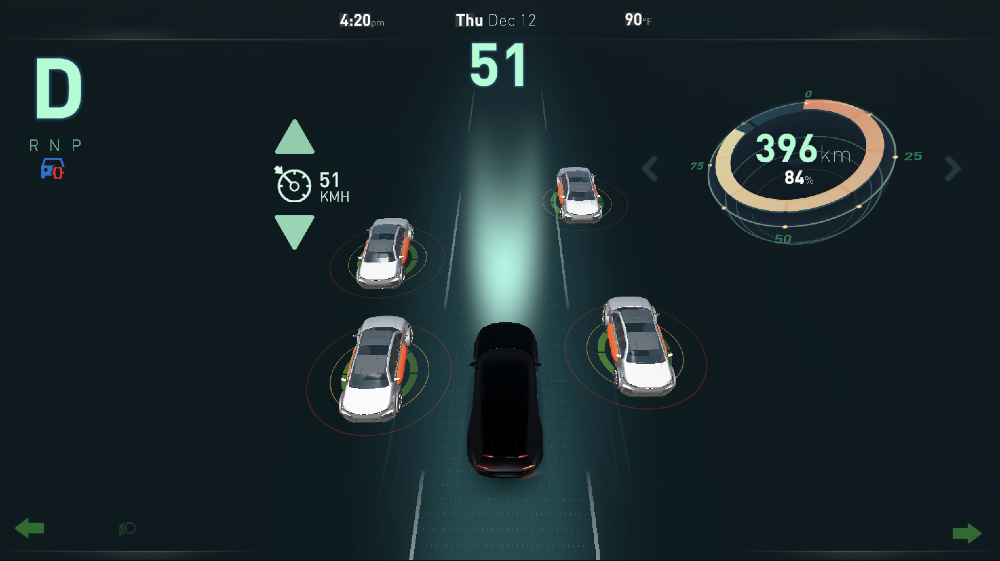
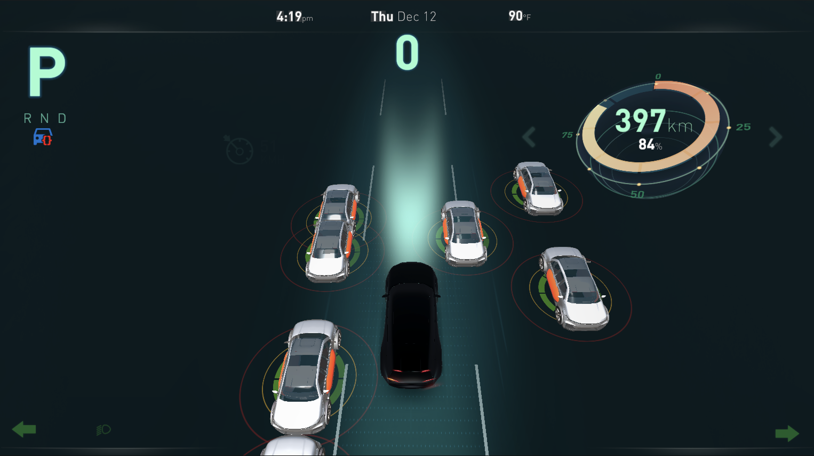

# Human-Machine Interface (HMI) for Advanced Driver Assistance Systems (ADAS)

## Overview
This repository contains the Unity 3D implementation of the Human-Machine Interface (HMI) designed for the **Lift-Splat-Blob (LSB)** method, a hybrid approach for real-time vehicle detection in Advanced Driver Assistance Systems (ADAS). The HMI provides an intuitive visualization of BEV outputs and blob detection results, enhancing the usability of the LSB system.

The HMI is developed in Unity 3D and is fully integrated with the LSB backbone available [here](https://github.com/lienghongky/cmx-lsb). This HMI project visualizes processed data from the LSB system, enabling real-time interaction and validation of detection results.

### HMI Visualizations
Below are some images showcasing the Human-Machine Interface (HMI) developed in Unity 3D:


|  |  |
|:-------------------------------------:|:-------------------------------------:|
| **HMI Parking Mode**               | **HMI Detecting Vehicles**               |

### [Lift-Splat-Blob (LSB)](https://github.com/lienghongky/cmx-lsb)


## Features
- **Real-Time Visualization**: Displays BEV vehicle detection results in an interactive Unity environment.
- **Customizable Interface**: Adjust HMI settings for various ADAS scenarios.
- **Integration with LSB**: Seamlessly connects to the LSB output pipeline for live or preprocessed data.

## Repository Structure
- **`Assets/`**: Unity project assets including scripts, prefabs, and materials.
- **`Docs/`**: Documentation and screenshots.
- **`README.md`**: Project documentation.

## Quick Start
### Prerequisites
- Unity 2021 or later
- Processed output from the LSB backbone repository: [cmx-lsb](https://github.com/lienghongky/cmx-lsb)

### Installation
1. Clone this repository:
   ```bash
   git clone https://github.com/lienghongky/cmx-hmi.git
   ```

2. Open the project in Unity:
   1. Launch Unity Hub.
   2. Select "Open Project" and navigate to the cloned directory.
   3. Open the project.

3. Ensure all dependencies are resolved in Unity.
- Automotive HMI Template from Unity Asset Store: [Automotive HMI Template](https://assetstore.unity.com/packages/templates/automotive-hmi-template-201095)


## Usage
### Setting Up Data
1. Process data using the LSB backbone system to generate BEV outputs. Follow the instructions in the LSB repository: [cmx-lsb](https://github.com/lienghongky/cmx-lsb).
2. Place the BEV output files into the `Assets/Data` directory of this Unity project.

### Running the HMI
1. Open the Unity Editor and load the main scene from `Assets/Scenes/MainScene.unity`.
2. Press the Play button in the Unity Editor to start the visualization.
3. View the real-time vehicle detection results in the BEV interface.

## Screenshots
### Main Interface


### BEV Output Visualization


## Linking to the LSB Repository
The full backbone implementation for the Lift-Splat-Blob (LSB) method is available in the LSB repository: [cmx-lsb](https://github.com/lienghongky/cmx-lsb).

Use the LSB repository to preprocess data, train models, and evaluate vehicle detection performance. This HMI repository is designed to complement the LSB system by providing a user-friendly interface for visualization.

## Acknowledgments
This project builds upon the Unity 3D capabilities to enhance the usability of the LSB system. Special thanks to the contributors of the LSB backbone for their foundational work in BEV transformations and vehicle detection.

## License
This project is released under the ****** Code License. See the `LICENSE` file for details.

